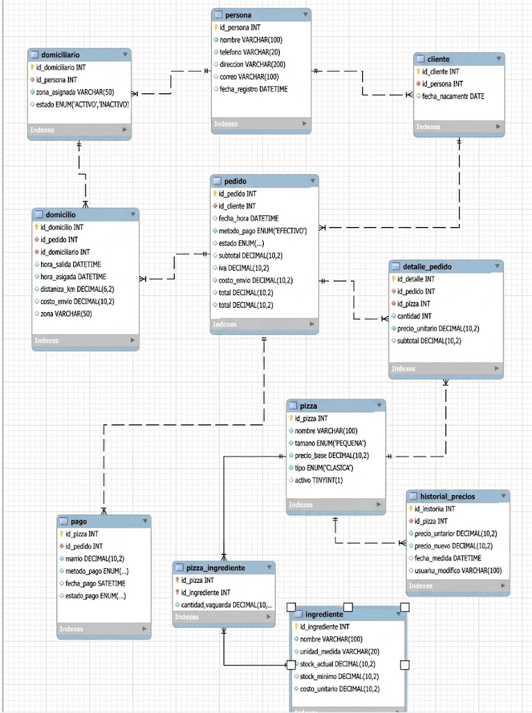

# 🍕 Pizzería Don Piccolo

Sistema de gestión de base de datos desarrollado en MySQL para la empresa ficticia **Pizzería Don Piccolo**.

El proyecto permite administrar clientes, pizzas, ingredientes, pedidos, pagos, repartidores y domicilios. Además, utiliza funciones, procedimientos almacenados, triggers, consultas y vistas para automatizar diferentes procesos del negocio.

---

## 📋 Descripción del proyecto

Pizzería Don Piccolo necesitaba mejorar el manejo manual de sus pedidos y domicilios.

Esta base de datos permite controlar el proceso completo de un pedido:
El sistema también permite:

- Registrar clientes.
- Registrar pizzas y sus ingredientes.
- Controlar el stock de ingredientes.
- Registrar pedidos con una o varias pizzas.
- Registrar pagos.
- Asignar domiciliarios a los pedidos.
- Calcular el total de un pedido.
- Calcular la ganancia neta diaria.
- Descontar ingredientes automáticamente del stock.
- Registrar cambios en los precios de las pizzas.
- Liberar automáticamente a un domiciliario después de una entrega.
- Consultar información mediante vistas.

---

## 🗄️ Base de datos
Para utilizar la base de datos:

```sql
USE pizzeria_don_piccolo;
```

---

## 📁 Estructura del proyecto

PIZZERIA_DON_PICCOLO
│
├── Tablas.sql
│ ├── Creación de la base de datos
│ ├── Creación de las tablas
│ └── Relaciones y claves foráneas
│
├── Inserts.sql
│ └── Datos de prueba
│
├── ConsultasSQL.sql
│ └── Consultas requeridas
│
└── Funciones.sql
├── Funciones
├── Procedimientos
├── Triggers
└── Vistas


---

## 🧱 Tablas y relaciones

### 👤 Persona

Guarda la información general de las personas.

- `id_persona`
- `nombre`
- `telefono`
- `direccion`
- `correo`

Esta tabla se relaciona con:

- `cliente`
- `domiciliario`

La idea es evitar repetir información personal.

### 👥 Cliente

Contiene la información específica de los clientes.

**Relación:**

Un cliente puede realizar muchos pedidos:

### 🛵 Domiciliario

Guarda la información de los repartidores.

Incluye:

- `zona_asignada`
- `estado`

Su estado puede indicar si está disponible o no disponible.

**Relación:**

Un domiciliario puede realizar varios domicilios:

### 🍕 Pizza

Guarda las pizzas disponibles en la pizzería.

Información principal:

- `id_pizza`
- `nombre`
- `tamano`
- `precio_base`
- `tipo`

Tipos de pizza:

- vegetariana
- especial
- clasica

Una pizza puede tener varios ingredientes.

### 🧀 Ingrediente

Controla los ingredientes utilizados en las pizzas.

Información principal:

- `id_ingrediente`
- `nombre`
- `unidad_medida`
- `stock_actual`
- `stock_minimo`
- `costo_unitario`

Esta tabla permite controlar cuándo un ingrediente tiene poco stock.

Por ejemplo:

Como:
ese ingrediente aparecerá en la vista `vista_stock_bajo`.

### 🍕🧀 Pizza_ingrediente

Esta es una tabla intermedia entre pizzas e ingredientes.

Una pizza puede tener varios ingredientes y un ingrediente puede utilizarse en varias pizzas.

También guarda:

- `cantidad_requerida`

Esta información es utilizada por el trigger que descuenta ingredientes del stock.

### 📝 Pedido

Guarda la información principal de los pedidos.

- `id_pedido`
- `id_cliente`
- `fecha_hora`
- `metodo_pago`
- `estado`
- `subtotal`
- `iva`
- `costo_envio`
- `total`

Un cliente puede tener varios pedidos:

Un pedido puede tener una o varias pizzas.

### 📦 Detalle_pedido

Relaciona los pedidos con las pizzas.

También registra:

- `cantidad`
- `precio_unitario`
- `subtotal`

El subtotal se calcula con:

### 🏠 Domicilio

Guarda la información de entrega de un pedido.

- `id_domicilio`
- `id_pedido`
- `id_domiciliario`
- `hora_salida`
- `hora_entrega`
- `distancia_km`
- `costo_envio`
- `zona`

**Relaciones:**

### 💳 Pago

Registra el pago de un pedido.

Información:

- `id_pago`
- `id_pedido`
- `monto`
- `metodo_pago`
- `fecha_pago`
- `estado_pago`

**Relación:**

### 📊 Historial_precios

Esta tabla almacena los cambios de precio realizados a las pizzas.

Por cada cambio guarda:

- `id_historial`
- `id_pizza`
- `precio_anterior`
- `precio_nuevo`
- `fecha_cambio`
- `usuario_modifico`

La información se registra automáticamente mediante un trigger.

---

## 🔍 Consultas SQL

### Clientes con pedidos entre dos fechas

Utiliza: `BETWEEN`, `JOIN`, `ORDER BY`

```sql
SELECT
    per.nombre AS cliente,
    pe.id_pedido,
    pe.fecha_hora,
    pe.total
FROM pedido pe
JOIN cliente c ON pe.id_cliente = c.id_cliente
JOIN persona per ON c.id_persona = per.id_persona
WHERE pe.fecha_hora BETWEEN '2026-08-01 00:00:00'
AND '2026-08-15 23:59:59';
```

### 🍕 Pizzas más vendidas

Utiliza: `COUNT`, `SUM`, `GROUP BY`

```sql
SELECT
    pz.nombre AS pizza,
    COUNT(dp.id_detalle) AS veces_pedida,
    SUM(dp.cantidad) AS unidades_vendidas
FROM detalle_pedido dp
JOIN pizza pz ON dp.id_pizza = pz.id_pizza
GROUP BY pz.id_pizza, pz.nombre
ORDER BY unidades_vendidas DESC;
```

### 🛵 Pedidos por repartidor

Utiliza: `JOIN`, `COUNT`, `GROUP BY`

```sql
SELECT
    per.nombre AS domiciliario,
    dm.zona_asignada,
    COUNT(dom.id_domicilio) AS pedidos_atendidos
FROM domiciliario dm
JOIN persona per ON dm.id_persona = per.id_persona
JOIN domicilio dom
ON dm.id_domiciliario = dom.id_domiciliario
GROUP BY dm.id_domiciliario, per.nombre, dm.zona_asignada;
```

### ⏱️ Promedio de entrega por zona

Utiliza: `AVG`, `TIMESTAMPDIFF`, `GROUP BY`

```sql
SELECT
    dom.zona,
    AVG(
        TIMESTAMPDIFF(
            MINUTE,
            dom.hora_salida,
            dom.hora_entrega
        )
    ) AS promedio_minutos
FROM domicilio dom
WHERE dom.hora_entrega IS NOT NULL
GROUP BY dom.zona;
```

### 💰 Clientes que gastaron más de un monto

Utiliza: `SUM`, `HAVING`

```sql
SELECT
    per.nombre AS cliente,
    SUM(pe.total) AS total_gastado
FROM pedido pe
JOIN cliente c ON pe.id_cliente = c.id_cliente
JOIN persona per ON c.id_persona = per.id_persona
GROUP BY c.id_cliente, per.nombre
HAVING SUM(pe.total) > 150000;
```

### 🔎 Buscar pizzas por nombre

Utiliza: `LIKE`

```sql
SELECT
    id_pizza,
    nombre,
    tamano,
    precio_base,
    tipo
FROM pizza
WHERE nombre LIKE '%Especial%';
```

### 👑 Clientes frecuentes

Un cliente frecuente es aquel que ha realizado más de 5 pedidos en un mismo mes.

Esta consulta utiliza una subconsulta:

```sql
SELECT
    per.nombre AS cliente_frecuente,
    frecuentes.mes,
    frecuentes.pedidos_en_el_mes
FROM (
    SELECT
        id_cliente,
        DATE_FORMAT(fecha_hora, '%Y-%m') AS mes,
        COUNT(*) AS pedidos_en_el_mes
    FROM pedido
    GROUP BY id_cliente, DATE_FORMAT(fecha_hora, '%Y-%m')
    HAVING COUNT(*) > 5
) AS frecuentes
JOIN cliente c ON frecuentes.id_cliente = c.id_cliente
JOIN persona per ON c.id_persona = per.id_persona;
```

---

## 🚀 Instrucciones para ejecutar el proyecto

### 📌 Orden de ejecución

Es importante ejecutar los archivos en este orden:
Tablas.sql
↓
Inserts.sql
↓
Funciones.sql
↓
ConsultasSQL.sql

---

## 🛠️ Tecnologías utilizadas

- MySQL
- MySQL Workbench
- SQL

---

## 🎯 Funcionalidades principales

- ✔ Registro de clientes
- ✔ Registro de pizzas
- ✔ Control de ingredientes
- ✔ Control de stock
- ✔ Registro de pedidos
- ✔ Registro de pagos
- ✔ Gestión de domicilios
- ✔ Gestión de repartidores
- ✔ Cálculo de IVA
- ✔ Cálculo del total de pedidos
- ✔ Cálculo de ganancia diaria
- ✔ Actualización automática de stock
- ✔ Auditoría de precios
- ✔ Liberación automática de repartidores
- ✔ Consultas SQL
- ✔ Vistas para consultas rápidas

---

## 👨‍💻 Autor

**Juan Pablo Navas Acosta**

Proyecto desarrollado como ejercicio académico para el aprendizaje de:

- Bases de datos relacionales
- MySQL
- Consultas SQL
- JOIN
- Funciones
- Procedimientos almacenados
- Triggers
- Vistas

---

## 📷 Diagrama entidad-relación

